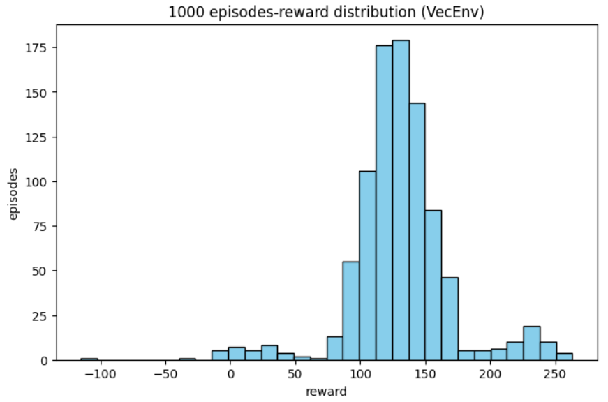

# REINFORCE算法

策略网络:

```python
class PolicyNet(nn.Module):

    def __init__(self, action_size: int):
        super().__init__()

        self.l1 = nn.LazyLinear(64)
        self.l2 = nn.LazyLinear(128)
        self.l3 = nn.LazyLinear(128)
        self.l4 = nn.LazyLinear(action_size)

    def forward(self, x: torch.Tensor) 
        x = F.dropout(F.relu(self.l1(x)))
        x = F.dropout(F.relu(self.l2(x)))
        x = F.dropout(F.relu(self.l3(x)))
        x = F.softmax(self.l4(x), dim=-1)
        return x
```
reinforce_lunar_lander.pth

